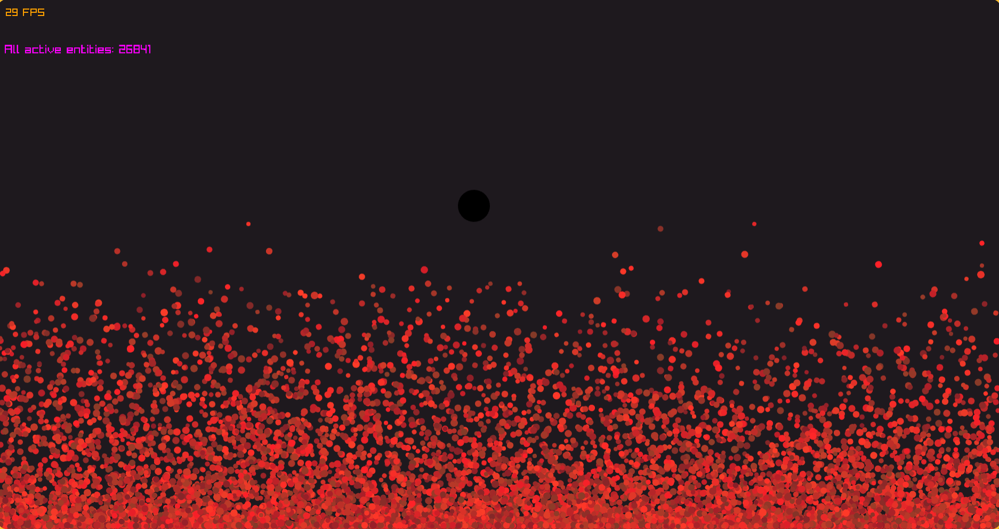

# Compecs

Compecs (Comptime + ECS) - it's proof-of-concept library written in Zig (0.17.0) via comptime.



## Requirements:
- Zig: 0.17.0

## Build:
```bash
zig fetch --save git+https://github.com/Hkmori15/compecs.git
```

```zig
const compecs_dep = b.dependency("compecs", .{
  .target = target,
  .optimize = optimize,
});

exe.root_module.addImport("compecs", compecs_dep.module("compecs"));
```

## Demo:
If u want u can run demo compecs lib with Raylib (thanks LazyDependency):

```bash
zig build run-demo --release=fast
```

### Control:
- WASD: move circle
- Left mouse: spawn entity
- Button R: remove entity - entity removes from left side mouse
